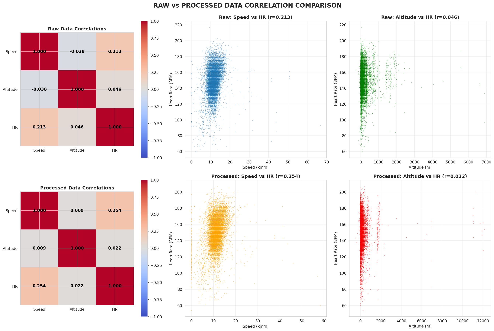
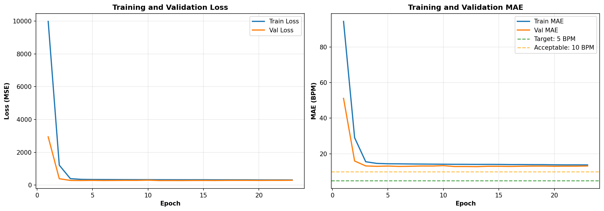
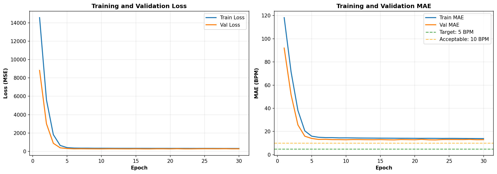
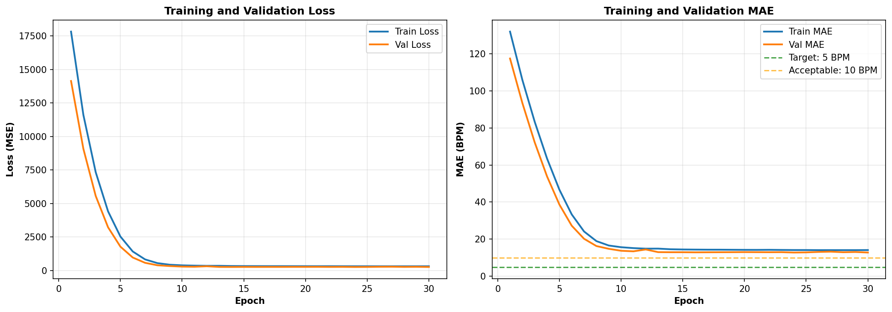
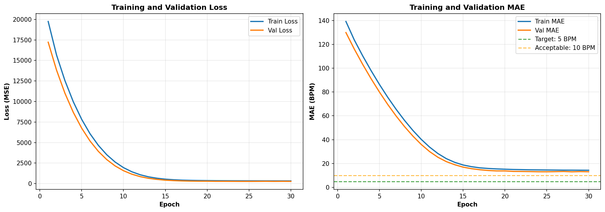

<!-- _class: lead -->
<!-- _paginate: false -->

# Heart Rate Prediction from Running Activity

## Deep Learning Course Project - CentraleSupélec

**From Challenging Public Data to Custom Solutions**

---

## Problem Statement

**Goal:** Predict heart rate time-series from running activity data

**Inputs:**
- Speed sequences (m/s)
- Altitude sequences (meters)
- User metadata (gender, userId)

**Output:** Heart rate predictions (BPM) over time

**Target Performance:** MAE < 10 BPM

**Why?** Health monitoring, fitness tracking, validate wearable sensors

---
## Dataset: Endomondo Challenge

**Initial Dataset:** FitRec (Endomondo)
- Total available: 260,000 workouts with HR data

**Major Problem: Data Quality**
- Applied 7 quality filters (valid sport, complete HR, GPS quality, etc.)
- **Result: Only 13,000 usable workouts (5% of total!)**

**Key Finding: Low Correlation**

- **Correlation Problem**

---

---

## First Models: LSTM and GRU

**Strategy: Max out VRAM for fast training**
- Basic LSTM: Batch size 128, 2 layers, 64 hidden units
- Result: MAE ~15 BPM

**Also tried GRU:** Similar performance (~15 BPM)

**Conclusion:** Architecture wasn't the problem, data quality was!

---

## Batch Size Experiment

**Hypothesis:** Smaller batches might help with noisy data

**Experiment:** Tested batch sizes 8, 16, 32, 64
- Same architecture (LSTM, 64 hidden, 2 layers)
- Same learning rate (0.001), 30 epochs each

**BS=8: Noisy** | **BS=16: BEST (but slowest)**

---

## Batch Size Results

**BS=32: Slightly worse** | **BS=64: Fast but generalizes poorly**

**Key Finding:** BS=16 optimal - we chose quality over speed

**Also tried:** Lag-Llama transfer learning (didn't help much with low correlations)

---

## The Breakthrough: Apple Watch Data

**New Approach:** Collect our own high-quality data!

**Custom Dataset:**
- 285 running workouts from us and friends (2019-2025)
- 6 years of training history
- Apple Watch sensors (consistent, high quality)

**Quality Comparison:**
- **Endomondo:** r ≈ 0.3 (weak)
- **Apple Watch:** r ≈ 0.68 (strong!)

**Data Evolution:** 17x more HR samples in 2025 vs 2019
- 2019: 0.7 HR samples/min (sparse)
- 2025: 12 HR samples/min (rich detail)

---

## Apple Watch Data Quality

**2025 Workout: High Quality (12 HR samples/min)**

**2019 Workout: Sparse Quality (0.7 HR samples/min)**

---

## Next Steps: Fine-Tuning Strategy

**Proposed Two-Stage Training:**

**Stage 1: Pre-train on Endomondo**
- Learn general speed-to-HR patterns from 13K workouts
- Capture population-level relationships

**Stage 2: Fine-tune on Apple Watch**
- Adapt to individual physiology using 285 high-quality workouts
- Leverage strong correlations (r=0.68)

**Expected Benefit:** Best of both worlds
- General knowledge from diverse users
- Personalization from high-quality individual data
- Target: MAE < 10 BPM

---

<!-- _class: lead -->

## Summary

**Key Insights:**
1. **Data Quality > Model Complexity** - 260K → 13K workouts (5% usable)
2. **Systematic Experiments** - Batch size search found BS=16 optimal
3. **Custom Data Collection** - Apple Watch: 17x better sampling, r=0.3 → 0.68
4. **Two-Stage Training** - Pre-train general + fine-tune personal

**Contributions:**
- Comprehensive data pipeline (Endomondo + Apple Watch)
- Systematic hyperparameter experiments
- Identified temporal distribution shift (2019 vs 2025 fitness evolution)

**Questions?**
