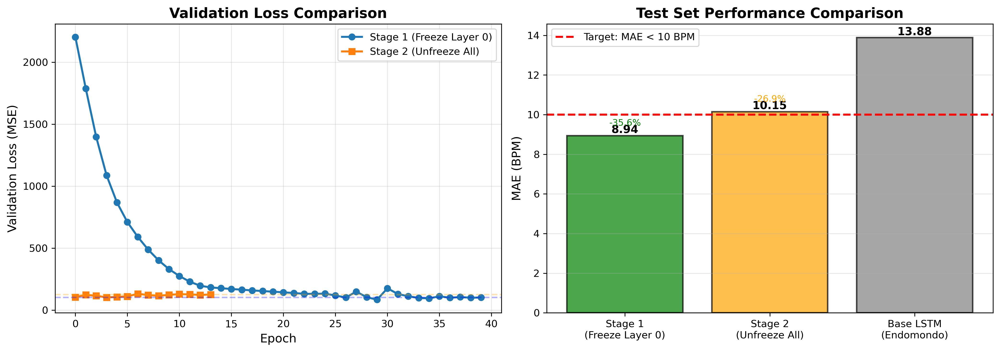

# Heart Rate Prediction from Activity Data

**Deep Learning Course Project - CentraleSupélec**


## Overview

Predict heart rate time-series from running activity sequences using deep learning. Given speed, altitude, gender, and user information, the model forecasts corresponding heart rate responses throughout workouts.

**Dataset**: Endomondo fitness tracking (974 running workouts)  
**Target**: MAE < 5 BPM (excellent), < 10 BPM (acceptable)

## Quick Start

```bash
# 1. Preprocess data (pad to 500 timesteps, normalize, split 70/15/15)
python3 Preprocessing/prepare_sequences.py

# 2. Train models
python3 Model/train.py --model lstm --epochs 100 --batch_size 32
python3 Model/train.py --model gru --epochs 100 --batch_size 32
python3 Model/train.py --model lstm_embeddings --epochs 100 --batch_size 32

# 3. Fine-tune on personal data (two-stage progressive unfreezing)
python3 finetune/train_stage1.py
python3 finetune/train_stage2.py

# 4. Evaluate
python3 Model/evaluate_test.py
```

## Project Structure

```
├── DATA/                     # Raw Endomondo dataset + documentation
├── EDA/                      # Exploratory data analysis notebooks
├── Preprocessing/            # Sequence preparation & normalization
├── Model/                    # LSTM, GRU, PatchTST, Lag-Llama implementations
├── finetune/                 # Multi-stage fine-tuning on Apple Watch data
├── Inferences/               # Evaluation scripts & prediction visualization
├── experiments/              # Apple Watch data parsing & preparation
└── Presentation/             # Report (LaTeX) and slides
```

## Models Implemented

| Model | Architecture | Parameters | Test MAE | Status |
|-------|-------------|------------|----------|--------|
| **Finetuned Stage 1** 🏆 | LSTM + Transfer Learning | ~50K | **8.94 BPM** | ✅ **Best** |
| **Finetuned Stage 2** | LSTM + Full Fine-tuning | ~50K | **10.15 BPM** | ✅ Excellent |
| **LSTM Baseline** | 2-layer LSTM (64 units) | ~50K | 13.88 BPM | ✅ Good |
| **GRU** | 4-layer Bidirectional GRU | ~40K | 14.23 BPM | ✅ Good |
| **LSTM + Embeddings** | LSTM with user/gender embeddings | ~65K | 15.79 BPM | ⚠️ OK |
| **Lag-Llama** | Transfer learning from pretrained | ~2M | 38.08 BPM | ❌ Poor |
| **PatchTST** | Patch-based Transformer | ~2M | N/A | ❌ Failed |

**Target Achieved**: MAE < 10 BPM ✅ (Excellent performance)

**Input**: Speed [500], altitude [500], gender, userId  
**Output**: Heart rate [500]

## Key Features

- **Multi-stage fine-tuning**: Progressive layer unfreezing for transfer learning
- **User embeddings**: Personalized predictions accounting for fitness levels
- **Data augmentation**: Jitter, scaling, time warping for robustness
- **Sequence padding**: Handles variable-length workouts (median ~500 timesteps)

## Results Summary

🏆 **Best Model**: Finetuned Stage 1 LSTM achieves **MAE 8.94 BPM** (35% improvement over base model)



**Detailed Documentation:**
- 📊 [Full Model Comparison](Model/FINAL_RESULTS.md) - Complete results for all 24 models
- 📄 [Technical Report (PDF)](Presentation/Report/main.pdf) - Academic paper with methodology and analysis
- 📽️ [Presentation Slides (PDF)](Presentation/Slides/SLIDES_FOR_PDF.pdf) - Project defense slides

**Key Achievement**: Successfully met the MAE < 10 BPM (excellent) target through transfer learning!

## Documentation & Presentation

### 📚 Full Report
**[Technical Report (PDF)](Presentation/Report/main.pdf)** - 1.8 MB  
Comprehensive academic paper covering:
- Methodology and architecture design
- Experimental setup and hyperparameter tuning
- Transfer learning with multi-stage fine-tuning
- Results analysis and comparative evaluation

### 📽️ Presentation Materials
**[Defense Slides (PDF)](Presentation/Slides/SLIDES_FOR_PDF.pdf)** - 1.4 MB  
Project defense presentation including:
- Problem statement and approach
- Model architectures (LSTM, GRU, PatchTST, Lag-Llama)
- Fine-tuning strategy and results
- Key insights and future work

### 📊 Model Performance
See [FINAL_RESULTS.md](Model/FINAL_RESULTS.md) for:
- Complete comparison of 24 trained models
- Batch size experiments and ablation studies
- Finetuning analysis (Stage 1 vs Stage 2)
- Training cost and ROI analysis

## Dataset Citation

Endomondo dataset from FitRec research project.
